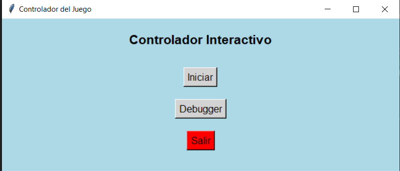
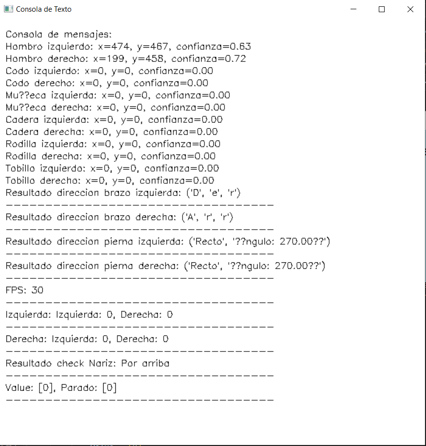

# Interfaz-Instintiva 

Este es un proyecto desarrollado sobre el control especializado con la cámara sobre una aplicación

### Pasos Previos

Hay que disponer de varias librerias, para ello primero se van a instalar los siguientes modulos

```python
pip install opencv-python
pip install numpy
pip install ultralytics
pip install pygetwindow
pip install pywin32
```
Luego se podrán instalar todas las librerías necesarias para la utilización de este proyecto

```python
import cv2
import numpy as np  
from ultralytics import YOLO

import pygetwindow as gw
import win32gui
import win32con
import ctypes
import os

import time
import math 

import tkinter as tk

from threading import Thread
import threading 
```
Todas estás librerías se pueden categorizar en 4 grupos distintos:

1. Librerías del Procesamiento de Imágenes
Este grupo de librerías se enfoca en la captura, manipulación y análisis de imágenes y video en tiempo real, facilitando tanto el procesamiento básico de imágenes como operaciones más complejas como la detección de objetos.

Librerías utilizadas: cv2, numpy, ultralytics YOLO.

2. Interacción con el Sistema Operativo y Gestión de Ventanas
Las librerías en este grupo permiten la interacción directa con el sistema operativo para manipular ventanas, obtener información del sistema y crear interfaces gráficas, asegurando que la aplicación pueda interactuar efectivamente con el entorno de escritorio del usuario.

Librerías utilizadas: pygetwindow, win32gui, win32con, tkinter, ctypes.

3. Utilidades Matemáticas
Este grupo incluye librerías dedicadas a proporcionar funciones matemáticas y gestionar el tiempo, esenciales para cálculos precisos y control de la temporización dentro de la aplicación.

Librerías utilizadas: time, math.

4. Programación Concurrente y Multihilo
Las herramientas de este grupo se utilizan para manejar múltiples procesos o hilos simultáneamente, permitiendo que la aplicación realice varias tareas al mismo tiempo de manera eficiente, como procesar imágenes mientras mantiene una interfaz de usuario responsiva.

Librerías utilizadas: threading.

### Objetivo

El objetivo de está practica es crear una aplicación que tenga la capacidad para manejar una aplicación en tiempo real.

El objetivo principal es crear una propuesta simple de control específico sobre una aplicación compleja. Esto permite sobre el tiempo crear casos para situaciones más complejas.

### Como poder ejecutar el codigo

Para poder ejecutar el codigo sobre una aplicación en concreta se requiere que este abierta dicha aplicación y tener una variable de la primera sección llamada "game" puesta con el nombre exacto de la ventana. 

Pero esto no es realmente obligatorio, el programa se puede poner en funcionamiento y probar sin necesidad de tener nada de esto activo

Tras iniciar el codigo, creará una pequeña interfaz grafica que permita empezar el proceso de la camara, empezarlo en un modo de debug o salir de la aplicación. 

<p align="center">
  
</p>

Tras elegir en cualquier modo intentará entrar a la aplicación así como iniciar la cámara.

    IMPORTANTE

    La cámara está puesta por defecto en el valor 1, si existe algún problema con el uso de la cámara, se debería mirar este valor

    Así mismo la aplicación debe de estar en modo ventana por facilidad de control.

En el modo Normal, solo existe la cámara junto con la aplicación mientras que con en el modo debug existe la cámara con el esqueleto remarcado con YOLO así como una consola personalizada que muestra bastante información interesante como valores de calculo sobre los brazos y piernas, valores de control así como el resultado de calculos de los valores utilizados para generar los controles.

<p align="center">
  
</p>

Hay que tener en cuenta el como funciona el codigo, solo simula pulsaciones o acciones con un mapeo de controles especifico. 

Una vez todo está activado los controles siguen un mapeo bastante intuitivo

1. **Brazo Izquierdo**: Controla todo el movimiento del juego y permite obtener subdirecciones donde se puede mezclar arriba con izquierda por ejemplo.
2. **Brazo derecho**: Este brazo controla la dirección a la que se dispara, se mapea y hereda bastante del brazo izquierda
3. **Pierna izquierda y derecha**: Las piernas controla valores distintos en movimiento de izquierda o derecha, teniendo cada dirección un motivo unico
4. **Cabeza**: Esta simplemente genera un movimiento que es el pause de la aplicación en base al movimiento de la naziz hacia abajo. Cuando está pulsado, ninguna otra opción será registrada.

<p align="center">
  
</p>

Si se quiere ver el proyecto a un nivel más detallado, se recomienda el Informe presentado en este mismo repositario donde se añade toda la posible información faltante, tales como el planteamiento del funcionamiento del proyecto, justificación del proyecto, y apartados extras.   